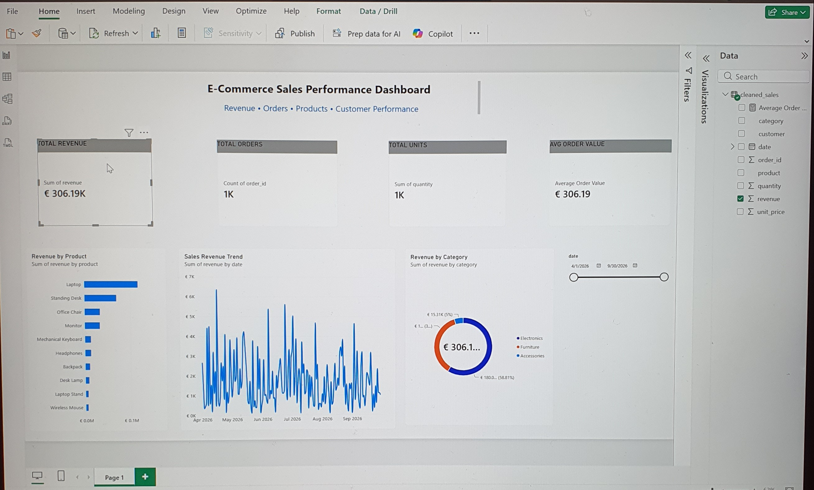

# Automated E-Commerce Sales Reporting System

An automated sales reporting workflow that transforms raw CSV sales data into cleaned, validated business data and an interactive Power BI dashboard.

The project demonstrates how repetitive sales reporting can be streamlined using Python and Power BI.

## Business Problem

Small e-commerce businesses often export sales data to Excel or CSV and manually clean, calculate, and prepare reports each week or month.

This workflow reduces that repetitive work by automating the data-processing stage and providing a reusable dashboard for business analysis.

## Solution

The system processes sales data through the following workflow:

```text
Raw CSV / Excel Export
        ↓
Data Ingestion
        ↓
Data Validation
        ↓
Data Cleaning
        ↓
KPI & Revenue Calculation
        ↓
Processed Reporting Data
        ↓
Power BI Dashboard
```

## Dashboard

The Power BI dashboard provides visibility into:

- Total Revenue
- Total Orders
- Total Units Sold
- Average Order Value
- Revenue by Product
- Revenue by Category
- Sales Revenue Trends
- Interactive Date Filtering

### Dashboard Preview



## Technologies
- Python
- pandas
- Power BI
- DAX
- CSV / Excel data processing
- Git

## Project Structure

```text
automated-sales-reporting/
│
├── data/
│   └── sales.csv
│
├── output/
│   ├── cleaned_sales.csv
│   ├── sales_metrics.csv
│   └── revenue_by_product.csv
│
├── pipeline/
│   ├── ingest.py
│   ├── validate.py
│   ├── clean.py
│   ├── metrics.py
│   ├── output.py
│   └── main.py
│
├── generate_demo_data.py
└── README.md
```

## How It Works

### 1. Ingestion
The pipeline loads raw sales transaction data from CSV.

### 2. Validation
Required columns and numeric fields are checked before processing. Invalid data can stop the pipeline before incorrect results reach the report.

### 3. Cleaning
The workflow removes duplicate rows, standardizes dates and text fields, and converts numeric fields into appropriate formats.

### 4. KPI Calculation
The pipeline calculates revenue and key business metrics including total revenue, order count, units sold, and average order value.

### 5. Output
Processed reporting files are automatically generated in the `output` directory.

### 6. Power BI
Power BI consumes the processed sales data and provides an interactive dashboard. When new data is processed, the existing dashboard can be refreshed instead of rebuilt manually.

## Running the Demo

Install the required Python packages:

```bash
pip install pandas openpyxl
```

Generate the synthetic demonstration dataset:

```bash
python generate_demo_data.py
```

Run the reporting pipeline:

```bash
python pipeline/main.py
```

The processed reporting files will be created in the `output` directory.

## Demo Data

The included dataset is **synthetic demonstration data generated specifically for this project**.

It does not represent a real company, customer, or actual business revenue.

The demo dataset contains 1,000 generated e-commerce orders across multiple products and categories.

## Potential Business Use

The workflow can be adapted for businesses that repeatedly work with sales exports from spreadsheets or other systems.

Future/custom implementations could include:

- Customer-specific Excel/CSV formats
- Database connections
- API integrations
- Scheduled data processing
- Automated dashboard refresh
- Additional business KPIs

## Author

**Victor Nwaigwe**

MSc Computational Sciences — Freie Universität Berlin

GitHub: https://github.com/niv-3